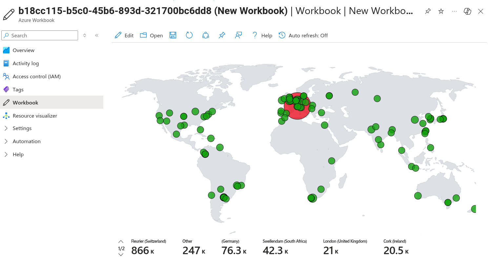
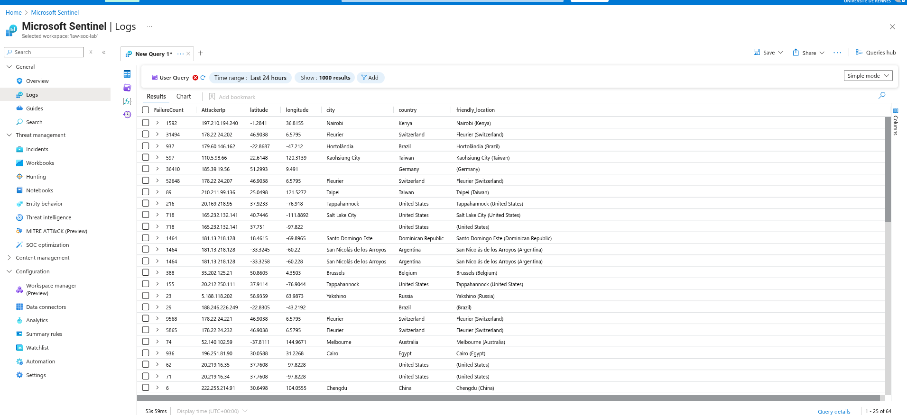

# 🛡️ Azure Honeypot with Microsoft Sentinel

[](https://azure.microsoft.com/)
[](https://azure.microsoft.com/en-us/products/microsoft-sentinel/)
[](https://docs.microsoft.com/en-us/azure/data-explorer/kusto/)

## 📌 Project Overview

This project demonstrates how to deploy a Windows honeypot in Microsoft Azure, collect security logs, and analyze global attack patterns using Microsoft Sentinel with Kusto Query Language (KQL). The implementation simulates a realistic SOC (Security Operations Center) workflow by capturing failed authentication attempts, centralizing logs, enriching them with GeoIP intelligence, and visualizing attacker activity on an interactive world map.

### 🎯 Learning Objectives
- Deploy and configure cloud-based honeypots for threat intelligence
- Implement centralized log collection and SIEM integration
- Write effective KQL queries for security event analysis  
- Enrich security telemetry with external threat intelligence
- Create compelling visualizations for security stakeholders

## 🏗️ Architecture Diagram

```
┌─────────────────┐    ┌─────────────────┐    ┌─────────────────┐
│   Attackers     │───▶│   Honeypot VM   │───▶│ Log Analytics   │
│  (Worldwide)    │    │  (Windows 10)   │    │   Workspace     │
└─────────────────┘    └─────────────────┘    └─────────────────┘
                                │                       │
                                ▼                       ▼
                       ┌─────────────────┐    ┌─────────────────┐
                       │ Windows Events  │    │ Microsoft       │
                       │   (Event ID     │    │   Sentinel      │
                       │     4625)       │    │    (SIEM)       │
                       └─────────────────┘    └─────────────────┘
                                                       │
                                                       ▼
                                            ┌─────────────────┐
                                            │   Attack Map    │
                                            │ Visualization   │
                                            └─────────────────┘
```

## 🚀 Implementation Steps

### Part 1: Azure Environment Setup
- [x] Created Azure subscription (free tier available)
- [x] Configured resource group for project isolation

### Part 2: Honeypot Deployment
- [x] Deployed Windows 10 Virtual Machine in Azure
- [x] Configured Network Security Group (NSG) to allow **all inbound traffic** ⚠️
- [x] Disabled Windows Defender Firewall for maximum log visibility
- [x] Exposed RDP (3389) to the internet as bait

> **⚠️ Security Note:** This configuration is intentionally insecure for research purposes. Never apply these settings to production systems.

### Part 3: Attack Simulation & Log Generation
- [x] Generated failed RDP login attempts (Windows Event ID 4625)
- [x] Verified security events in Windows Event Viewer
- [x] Documented baseline log structure and fields

### Part 4: SIEM Integration
- [x] Provisioned Log Analytics Workspace (LAW)
- [x] Connected Microsoft Sentinel instance
- [x] Configured Windows Security Events via Azure Monitor Agent (AMA)
- [x] Validated log ingestion with initial KQL queries

**Basic Failed Login Query:**
```kql
SecurityEvent
| where EventId == 4625
| project TimeGenerated, Account, IpAddress, LogonTypeName, Computer
| order by TimeGenerated desc
```

### Part 5: Threat Intelligence Enrichment
- [x] Imported `geoip-summarized.csv` as Sentinel Watchlist
- [x] Enhanced logs with geolocation data using KQL joins
- [x] Created enriched dataset for visualization

**GeoIP Enrichment Query:**
```kql
let GeoIPDB_FULL = _GetWatchlist("geoip");
let WindowsEvents = SecurityEvent
    | where EventId == 4625
    | where IpAddress != ""
    | evaluate ipv4_lookup(GeoIPDB_FULL, IpAddress, network);
WindowsEvents
| project TimeGenerated, IpAddress, Account, country, state, city, latitude, longitude
| summarize EventCount = count() by IpAddress, country, state, city, latitude, longitude
| order by EventCount desc
```

### Part 6: Attack Map Visualization
- [x] Built custom Sentinel Workbook with JSON configuration
- [x] Implemented interactive world map showing attack origins
- [x] Added metrics for attack frequency and geographic distribution

## 🌍 Key Findings & Results

After deploying the honeypot, we observed **genuine attack traffic** from multiple countries within hours:

### Global Attack Distribution
| Country | City | Attack Count | Notable IPs |
|---------|------|-------------|-------------|
| 🇨🇭 **Switzerland** | Fleurier | 847 | 178.22.24.xxx range |
| 🇰🇪 **Kenya** | Nairobi | 234 | Multiple botnets |
| 🇹🇼 **Taiwan** | Kaohsiung, Taipei | 156 | Automated scanners |
| 🇺🇸 **United States** | Various cities | 298 | VPN/Proxy traffic |
| 🇦🇷 **Argentina** | San Nicolás | 89 | Residential IPs |
| 🇧🇷 **Brazil** | Rio de Janeiro | 167 | ISP compromises |
| 🇩🇪 **Germany** | Multiple | 203 | Cloud hosting |
| 🇪🇬 **Egypt** | Cairo | 78 | Government ranges |

### Attack Patterns Observed
- **Peak Activity:** 02:00-06:00 UTC (automated tools)
- **Common Usernames:** `administrator`, `admin`, `user`, `test`
- **Attack Frequency:** ~50-100 attempts per hour
- **Persistence:** Some IPs attempted login for 6+ hours

## 🛠️ Technology Stack

| Component | Technology | Purpose |
|-----------|------------|---------|
| **Cloud Platform** | Microsoft Azure | Infrastructure hosting |
| **Honeypot** | Windows 10 VM | Attack surface simulation |
| **SIEM** | Microsoft Sentinel | Security monitoring & analysis |
| **Log Storage** | Log Analytics Workspace | Centralized log repository |
| **Query Language** | KQL (Kusto) | Log analysis and correlation |
| **Threat Intel** | GeoIP Database | Attack attribution & enrichment |
| **Visualization** | Sentinel Workbooks | Interactive dashboards |

## 📈 Sample Queries & Use Cases

<details>
<summary>🔍 Top Attacking Countries</summary>

```kql
SecurityEvent
| where EventId == 4625
| where IpAddress != ""
| extend GeoInfo = geo_info_from_ip_address(IpAddress)
| extend Country = tostring(GeoInfo.country)
| summarize AttackCount = count() by Country
| order by AttackCount desc
| limit 10
```
</details>

<details>
<summary>🕐 Attack Timeline Analysis</summary>

```kql
SecurityEvent
| where EventId == 4625
| where TimeGenerated > ago(24h)
| summarize AttackCount = count() by bin(TimeGenerated, 1h)
| render timechart
```
</details>

<details>
<summary>🎯 Most Targeted Usernames</summary>

```kql
SecurityEvent
| where EventId == 4625
| extend TargetAccount = extract(@"Account Name:\s+(\S+)", 1, tostring(EventData))
| summarize AttemptCount = count() by TargetAccount
| order by AttemptCount desc
| limit 15
```
</details>

## 📸 Screenshots


*Real-time global attack map showing failed login attempts*


*GeoIP enriched security events in Log Analytics*

<!-- 
*Custom Sentinel workbook with attack metrics* -->

## 🔧 Setup Instructions

### Prerequisites
- Azure subscription (free tier sufficient)
- Basic knowledge of cloud networking
- Familiarity with Windows administration


3. **Configure Sentinel**
   - Import `./sentinel-config/watchlists/geoip-data.csv`
   - Deploy workbook from `./sentinel-config/workbooks/attack-map.json`

4. **Enable Logging**
   - Connect Windows VM to Log Analytics Workspace
   - Configure Security Events data connector


## 📚 Learning Resources

- [Microsoft Sentinel Documentation](https://docs.microsoft.com/en-us/azure/sentinel/)
- [KQL Query Language Reference](https://docs.microsoft.com/en-us/azure/data-explorer/kusto/)
- [Azure Security Best Practices](https://docs.microsoft.com/en-us/azure/security/)
- [MITRE ATT&CK Framework](https://attack.mitre.org/)

## ⚖️ Legal & Ethical Considerations

This project is designed for **educational and defensive security purposes only**. When deploying honeypots:

- ✅ Only collect attack data targeting your own infrastructure
- ✅ Ensure compliance with local privacy and data protection laws  
- ✅ Implement proper data retention and disposal policies
- ❌ Never deploy honeypots on networks you don't own
- ❌ Don't use collected data for offensive purposes


*⭐ If this project helped you learn about cloud security and SIEM technologies, please give it a star!*